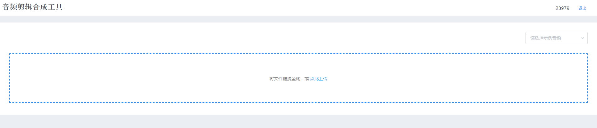
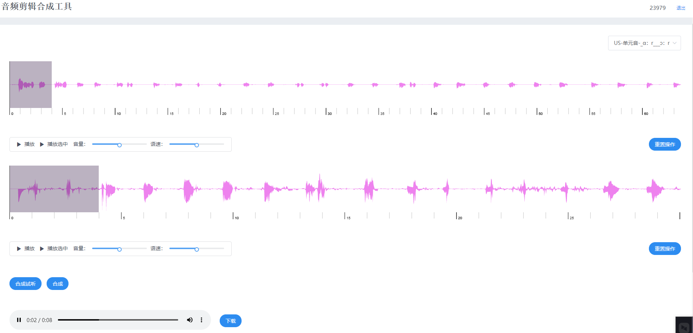

# 音频剪辑合成工具

## 简介

音频剪辑合成小工具，主要功能是把多个音频中不同的片段一键剪辑到同一音频当中，并提供下载。
不调用任何服务端接口，纯前端编写。

### 测试环境
https://audio.zekozhang.top/#/login

## 工具截图

### 初始页面



### 合成页面



## 功能说明

+ 选择拖拽上传音频
+ 试听完整音频
+ 试听选中音频片段
+ 一键试听片段合成音
+ 一键合成片段合成音
+ 下载片段合成音


## 技术栈

``` bash
vue
elementUI
```
## Build Setup

``` bash
# install dependencies
npm install

# serve with hot reload at localhost:8080
npm run dev

# build for production with minification
npm run build

# build for production and view the bundle analyzer report
npm run build --report
```

## 声明

+ 工具中配置的音频为本地配置，直接添加音频到static/audio目录，并在audio.json中相应配置即可。原音频可能存在侵权，已删除。
+ 非专业前端，作为学习辅助工具，主要为实现功能。已遵循MIT协议开源，可自行fork修改。
